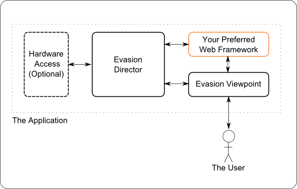

================
Evasion Project
================

:license: Evasion Project COMMON DEVELOPMENT AND DISTRIBUTION LICENSE Version 1.0
:URI: http://www.evasionproject.com

.. contents::

What is it?
============

The EvasionProject is a toolbox that allows you to make Point of Sale (POS), Ticket Pickup
Machines or even cross-platform applications. It is written in Python_ for rapid development
and cross platform support.

Who uses it?
============

NewmanOnline_ provides a Cinema Administration and Ticketting system. It uses the EvasionProject
as the basis for its Windows based ATM, Kiosk and Usherpoint systems. These are used through-out
Europe and allow for unmanned sales and pickup.

PythonPro_ uses the EvasionProject as the basis for its Prepay Internet Cafe system. It is used
to manage the various part of its highly customised Linux client.

How does it work?
=================

The EvasionProject allows you to create a the graphical user interface (GUI) using standard HTML,
Javascript, CSS talking to a Python web application. The GUI is displayed using a custom Firefox
browser called a Viewpoint. The web application can use physical devices, for example magnetic
swipes, ticket printers, chip and pin payment devices.

Why Use it?
===========

* The license is compatible with commercial closed source projects.

* Web application development is faster and much more flexible then traditional GUI toolkit approaches.

* Modern CSS can completely change the look without affecting the operation.

* The EvasionProject runs on most major platform Windows, Linux or Mac OSX.

* The project is a highly modular toolbox, you can use all of it or just the parts you need.

* The project allows a web application developer to escape the confines of "just" web development.

* It allows easily creation of projects that could be desktop bound and/or or have access to hardware and local services.

Project Parts
=============

The project "toolbox" is made up of a number of parts. Each of these parts is a Python_ package
under the "evasion" namespace.

Web
---

The "evasion.web" is a customised version of the Pylons_ web framework. It allows a web application
to be made out of "Apps". Each "App" could provide all of the web application or specific parts. Each
App is a special Python_ package. They can derive from each other and so can allow highly reuseable
functionality to be developed.

"evasion.web" can be used on its own and is not dependant on the other parts. It could also be
potentially be replaced with other web framework such as Django_, Flask_, etc. You could
even decide to use static files and javascript to generate the interface.

Director
--------

The "evasion.director" is an init.d like management program. It runs and maintains the broker,
agency, web application, viewpoint and any other program under its care.

The director uses simple INI based configuration. It can be configured to run an arbitrary amount
of programs used to make up an application.

Broker
~~~~~~~

The broker is the heart of messaging and hardware abstraction. The "evasion.messenger" library is
the higher level library all parts when dealing with it. The director provides its own STOMP_ broker
based on the MorbidQ_by default. For larger scale systems, distributed across a network, other
brokers could be used for example ActiveMQ_ or RabbitMQ_. This would allow for seamless scalability
as the messaging traffic increases.

Agency
------

The agency manages the hardware drivers called agents. An agent is simply a special Python_
package conforming to a certain interface. The agents are dynamically loaded from director
configuration at run time.

Viewpoint
---------

The viewpoint is a XUL_ application which is run on the latest Firefox_ or GRE_ (Gecko Runtime
Environment). This allows your web application to use the very latest features of HTML5, CSS3
and Javascript. This viewpoint also provides a single browser type to develop for. This means
no hack are needed to support other browsers. If Firefox_ supports it, you can use it!

The Evasion viewpoint is generally a reference implementation and companies to to branch it
and implement their own versions. This allows you to customise the start or screen or further
refine the interface.

Messenger
---------

The "evasion.messger" is the communication library used as part of the hardware abstraction
process. A Publish/Subscribe system is implemented on top of the STOMP_ protocol. This allows
communication across processes, programs and even machines distributed across a network. The
Publish/Subscribe system uses pydispatcher_ at its heart.

Project Documentation
=====================

API
---

.. toctree::
    :maxdepth: 3

    evasion-web.rst
    evasion-director.rst
    evasion-agency.rst
    evasion-viewpoint.rst
    evasion-messenger.rst

Issue Tracker
-------------

 * http://www.evasionproject.com/report/1

Launchpad Code Repository
-------------------------

 * https://launchpad.net/evasionproject
 * https://launchpad.net/~evasion-team

Wiki
----

 * http://www.evasionproject.com/wiki

App Store
---------

This is a PyPi like store of all the third party apps which can be used with the evasion.web project.
The following URI can be used with easy_install to download apps from.

 * http://apps.evasionproject.com

Agent Store
-----------

This is a PyPi like store of all the third party agents which can be used with the evasion.agency.
The following URI can be used with easy_install to download apps from.

 * http://agents.evasionproject.com

.. _GRE: https://developer.mozilla.org/en/gre
.. _Firefox: http://www.mozilla-europe.org/en/firefox/
.. _XUL: https://developer.mozilla.org/en/xul
.. _PythonPro:     http://#
.. _pydispatcher: http://pydispatcher.sourceforge.net/
.. _ActiveMQ: http://activemq.apache.org/
.. _RabbitMQ: http://www.rabbitmq.com/
.. _MorbidQ: http://www.morbidq.com/
.. _STOMP: http://stomp.codehaus.org/Protocol
.. _Python: http://www.python.org/
.. _Pylons: http://pylonshq.com/
.. _Flask: http://flask.pocoo.org/
.. _Django: http://www.djangoproject.com
.. _NewmanOnline: http://www.newmanonline.org.uk
